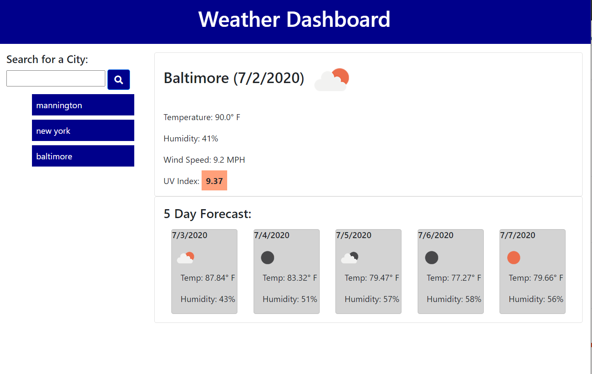

# Weather Dashboard

This is the weather dashboard we had to create for homework #6.

Deployed app: https://tmylesc.github.io/homework6/

This lets you search for a city and load both the current weather conditions and a five day forecast. Every time you search for a city it gets added to a search history list. You can click on each city on the list and it will load the weather info for that city. The city list is saved in local storage so that when you open the site again the search history list loads again.

